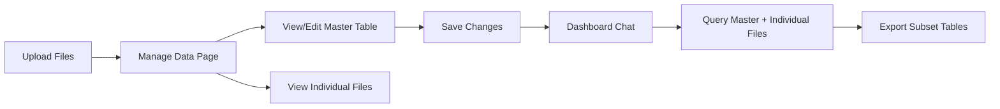

# Implementation Plan: Remaining Features

## Overview

Implement the following features to complete the Technical Challenge requirements:
1. **Inline editing** in master table
2. **Cross-table querying** with source file tracking
3. **Export generated subset tables** from chat
4. **Data validation UI** feedback
5. **Manage Data panel** (new page after upload)

---

## User Flow (Revised)



---

## Proposed Changes

### 1. New: Manage Data Page

#### [NEW] [manage/page.tsx](file:///Users/WongKang/Documents/adminless/frontend/app/manage/page.tsx)

A new page after upload where users can:
- View merged master table (editable)
- View individual source files (read-only)
- Save edited master table
- Proceed to Dashboard

**Layout:**
```
┌─────────────────────────────────────────┐
│ Manage Data                    [Save]   │
├─────────────────────────────────────────┤
│ Master Dataset (50 rows)        [Edit]  │
│ Built from: file1.csv, file2.csv        │
│ ┌─────────────────────────────────────┐ │
│ │ Editable DataTable                  │ │
│ └─────────────────────────────────────┘ │
├─────────────────────────────────────────┤
│ Source Files                            │
│ ▼ file1.csv (25 rows)                   │
│   [Read-only table]                     │
│ ▼ file2.csv (25 rows)                   │
│   [Read-only table]                     │
└─────────────────────────────────────────┘
```

---

### 2. Backend: Store Individual DataFrames

#### [MODIFY] [upload.py](file:///Users/WongKang/Documents/adminless/backend/src/api/routes/upload.py)

- Save each file as a separate pickle: `/home/user/{filename}.pkl`
- Continue saving merged as `/home/user/df_master.pkl`
- Return list of filenames in response

#### [MODIFY] [data.py](file:///Users/WongKang/Documents/adminless/backend/src/api/routes/data.py)

- Add endpoint: `GET /api/data/files` - Returns list of loaded files
- Add endpoint: `GET /api/data/preview/{filename}` - Preview specific file
- Add endpoint: `POST /api/data/update` - Save edited master table

---

### 3. Inline Editing

#### [NEW] [EditableDataTable.tsx](file:///Users/WongKang/Documents/adminless/frontend/components/EditableDataTable.tsx)

- Extend existing `DataTable` with editable cells
- Track changes locally
- Provide `onSave` callback with modified rows

---

### 4. Export Subset Tables from Chat

#### [MODIFY] [dashboard/page.tsx](file:///Users/WongKang/Documents/adminless/frontend/app/dashboard/page.tsx)

- Add "Download" button next to chat response tables
- Button calls `/api/data/export-subset` with table data

#### [NEW] [export.py - subset route](file:///Users/WongKang/Documents/adminless/backend/src/api/routes/export.py)

- Add `POST /api/data/export-subset` - Accepts JSON table data, returns CSV/XLSX

---

### 5. Cross-Table Querying

#### [MODIFY] [chat.py](file:///Users/WongKang/Documents/adminless/backend/src/api/routes/chat.py)

- Update agent context to include individual file schemas
- Agent can reference: `df_master`, `df_file1`, `df_file2`, etc.

#### [MODIFY] [core.py (agent)](file:///Users/WongKang/Documents/adminless/backend/src/agent/core.py)

- Update system prompt to explain available DataFrames
- Include cross-referencing examples

---

### 6. Data Validation UI

#### [MODIFY] [upload/page.tsx](file:///Users/WongKang/Documents/adminless/frontend/app/upload/page.tsx)

- Show validation errors (empty files, parse errors)
- Display file preview before upload
- Show column types detected

---

## Priority Order

1. **Backend: Store individual files** (enables cross-table queries)
2. **Manage Data page** (required by challenge)
3. **Inline editing** (required by challenge)
4. **Cross-table querying** (agent context update)
5. **Export subset tables** (quality of life)
6. **Validation UI** (polish)

---

## Verification Plan

- Upload 2+ files → Manage Data shows merged + individual
- Edit cell in master → Save → Verify in subsequent queries
- Ask cross-table query: "Show rows from file1 that match file2"
- Export table from chat response
- Upload empty/malformed file → See validation error
